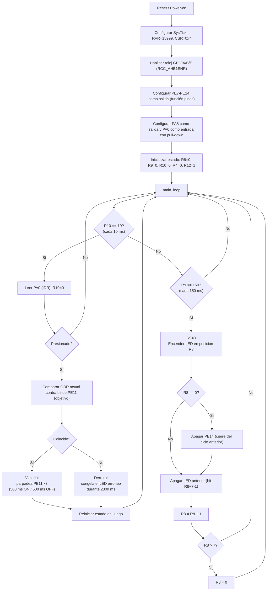
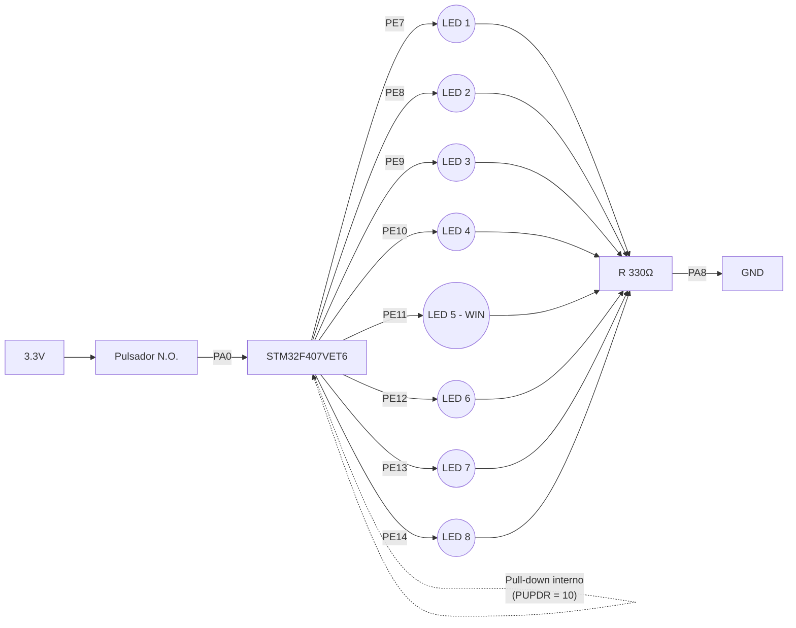

# Probador de Reflejos con Matriz de LEDs — STM32F407VE

Firmware en ensamblador utilizando segger para un probador de reflejos: un LED recorre una fila de 8 LEDs (PE7–PE14) de forma continua, y el usuario debe presionar un pulsador (PA0) en el instante en que el LED encendido coincida con el LED objetivo (PE11, la posición central de la fila).

## Estructura del repositorio

```
/
├── src/
│   └── Tarea 1.s     # Programa completo en ensamblador Thumb-2
└── README.md                 # Este archivo (documentación técnica)
```

---

## 1. Estrategias de desarrollo

### 1.1 Efecto visual del desplazamiento (barrido)

El barrido se implementa con un único registro índice, `R8` (rango 0–7), que representa la posición actual dentro de la fila. La conversión de índice a pin físico es `pin = 7 + R8` (es decir, R8=0 → PE7, R8=7 → PE14).

**Primer intento (con error):** la primera versión intentaba "apagar el LED anterior" calculando su posición dentro de la *misma* llamada en la que se encendía el LED actual (`LSR R2,#1` sobre la máscara recién usada, seguido de un `BIC`). Esto funciona perfectamente para el tramo PE7→PE14 (el "anterior" de cualquier pin intermedio es, en efecto, el bit inmediato inferior), pero **falla exactamente en el punto de reinicio del ciclo**: cuando el índice vuelve a 0 (PE7), el "anterior" calculado por esa fórmula es un bit sin LED real (PE6), así que **PE14 nunca se apagaba** y quedaba encendido de forma permanente después de la primera vuelta completa.

**Segundo intento (con error distinto):** se agregó una limpieza explícita de PE14 usando su número de bit fijo (`LSL #14` + `BIC`), pero colocada en el mismo instante en que PE14 se encendía — es decir, se encendía y se apagaba dentro de la misma ejecución, sin que transcurriera tiempo real entre ambas acciones. El resultado observado en la placa fue que PE14 nunca llegaba a verse encendido.

**Solución final:** la limpieza de PE14 se difiere hasta la *siguiente* vez que se ejecuta la rutina de barrido (es decir, hasta que el índice ya volvió a 0 y le toca a PE7 de nuevo). Así, PE14 permanece encendido durante todo su intervalo completo, y recién se apaga justo antes de que PE7 se encienda en la vuelta siguiente:

```asm
instruccion:
    ... enciende el LED en la posición R8 (EOR sobre el bit 7+R8) ...
    CMP R8, #0
    BEQ borrar        ; si esta llamada le tocaba a PE7, primero apaga PE14
    B continuar
borrar:
    ... apaga PE14 explícitamente (bit 14 fijo) ...
    B continuar
continuar:
    ... apaga el LED "anterior" (bit inmediato inferior) ...
    ... incrementa R8, con wrap-around de 7 a 0 ...
```

Este es un ejemplo directo de por qué el orden temporal de las operaciones importa tanto como su corrección lógica: la misma instrucción `BIC` sobre PE14, ejecutada en el "momento" equivocado del ciclo, produce resultados visualmente muy distintos aunque el álgebra de bits sea idéntica.

### 1.2 Antirrebote (debouncing) del pulsador

Se implementó una técnica de **muestreo periódico**, más simple que un filtro de N-lecturas-consecutivas-estables: el `SysTick_Handler` incrementa un contador de milisegundos (`R10`) en cada tick, y el `main_loop` solo consulta el estado físico del botón **una vez cada 10 ms** (`CMP R10,#10`), reiniciando el contador en cada consulta.

Esto reduce drásticamente la probabilidad de que un rebote mecánico (que típicamente dura entre 1 y 5 ms) coincida exactamente con el instante de muestreo, sin necesitar múltiples lecturas consecutivas ni una variable adicional de "confirmación". Es una técnica más ligera que la de conteo-hasta-umbral usada en iteraciones anteriores del proyecto, adecuada porque aquí no se requiere distinguir un "clic sostenido" de un "clic simple": basta con capturar el estado del botón en una ventana de tiempo lo suficientemente espaciada de los rebotes.

---

## 2. Cálculos de Temporización

### 2.1 Fuente de reloj

El programa no reconfigura el árbol de reloj (no toca `RCC_CFGR`, `PLLCFGR`, ni el registro de conmutación de fuente), por lo que el sistema permanece en su configuración de reset: **reloj interno a 16 MHz**, con los prescaladores AHB/APB en `/1`. `SYST_CSR.CLKSOURCE = 1` selecciona el reloj del procesador (no el reloj externo `/8`), por lo que el SysTick cuenta directamente a la frecuencia de la CPU:

```
f_SYSCLK = 16 MHz  (HSI, sin PLL)
f_SysTick = f_SYSCLK / 1 = 16,000,000 Hz
```

### 2.2 Cálculo del valor de recarga (SYST_RVR)

El SysTick genera una excepción cada vez que `SYST_CVR` cuenta desde `SYST_RVR` hasta 0 (es decir, cuenta `RVR + 1` ciclos de reloj por período). La fórmula general para obtener un período deseado `T` (en segundos) es:

```
SYST_RVR = (f_SysTick × T) − 1
```

Para un tick de **1 ms** (T = 0.001 s), que es el que usa el programa:

```
SYST_RVR = (16,000,000 Hz × 0.001 s) − 1
         = 16,000 − 1
         = 15,999
```

Este es exactamente el valor cargado en el código (`LDR R1,=15999`). Con esto, cada interrupción de SysTick representa **1 ms real**, y todos los demás tiempos del programa se derivan contando estas interrupciones en software (no se reconfigura `SYST_RVR` en ningún otro punto).

### 2.3 Temporizaciones derivadas (a partir del tick de 1 ms)

| Evento | Contador usado | Umbral | Tiempo real resultante |
|---|---|---|---|
| Avance del barrido (siguiente LED) | `R9` | 150 | 150 ms por posición |
| Muestreo del pulsador (antirrebote) | `R10` | 10 | cada 10 ms |
| Media fase de parpadeo de victoria | `R9` (reutilizado) | 500 | 500 ms encendido / 500 ms apagado |
| Duración total de la animación de victoria | `R4` × (500+500) ms | 3 repeticiones | ≈ 3000 ms |
| Congelamiento tras un fallo | `R9` (reutilizado) | 2000 | 2000 ms |

**Nota técnica:** dado que `R9` es reutilizado como base de tiempo tanto para el barrido como para el parpadeo de victoria, y no se reinicia a 0 justo antes de entrar a la secuencia de victoria, la **primera** media-fase del primer parpadeo puede ser ligeramente más corta que 500 ms (la diferencia entre 500 y el valor que `R9` ya traía acumulado en ese instante, que está acotado entre 0 y 149 ms). Las fases siguientes sí son exactas, porque `R9` se reinicia explícitamente a 0 después de cada una.

---

## 3. Registro de Configuraciones

| Registro | Dirección base | Offset | Dirección efectiva | Valor final | Justificación técnica |
|---|---|---|---|---|---|
| SYST_CSR | 0xE000E010 | 0x00 | 0xE000E010 | `0x7` (`0b111`) | `ENABLE=1` arranca el contador; `TICKINT=1` habilita la excepción al llegar a 0; `CLKSOURCE=1` usa el reloj del procesador (16 MHz) en vez del reloj externo `/8`. |
| SYST_RVR | 0xE000E010 | 0x04 | 0xE000E014 | `0x3E7F` (15999) | Produce un período de excepción de exactamente 1 ms a 16 MHz (ver sección 2.2). |
| SYST_CVR | 0xE000E010 | 0x08 | 0xE000E018 | `0x0` | Se limpia antes de habilitar el contador para forzar una recarga limpia desde `SYST_RVR` en el primer ciclo, evitando un primer período parcial/impredecible. |
| RCC_AHB1ENR | 0x40023800 | 0x30 | 0x40023830 | `0x13` (`0b10011`) | Bit0 (GPIOAEN), bit1 (GPIOBEN) y bit4 (GPIOEEN) en 1: habilita el reloj de los tres puertos usados por el diseño (GPIOB no se usa actualmente en la lógica, pero su reloj queda habilitado sin costo funcional). |
| GPIOE_MODER | 0x40021000 | 0x00 | 0x40021000 | `0x15554000` | Cada uno de los pines PE7–PE14 recibe `01` (salida de propósito general) en su campo de 2 bits, generado dinámicamente por la función `pines` en un bucle (evita repetir manualmente 8 bloques idénticos). El resto de los pines queda en su valor de reset (`00`, entrada). |
| GPIOA_MODER | 0x40020000 | 0x00 | 0x40020000 | `0xA8010000` | Valor de reset (`0xA8000000`, que deja PA13/PA14/PA15 en modo AF para SWD/JTAG) con el campo de PA8 forzado a `01` (salida, LED auxiliar) y el de PA0 forzado a `00` (entrada, pulsador). |
| GPIOA_PUPDR | 0x40020000 | 0x0C | 0x4002000C | `0x64000002` | Valor de reset (`0x64000000`, pull-up/down por defecto de los pines JTAG) con el campo de PA0 puesto en `10` (pull-down): mantiene la línea en bajo cuando el pulsador (normalmente abierto, activo en alto) no está presionado. |
| GPIOE_ODR | 0x40021000 | 0x14 | 0x40021014 | Dinámico | Se inicializa en `0x0` (todos los LEDs apagados) y luego cambia continuamente durante la ejecución: el bit `(7 + R8)` representa el LED actualmente encendido del barrido. No tiene un "valor final" fijo, su estado se rige por la máquina de estados descrita en el diagrama de flujo. |
| GPIOA_ODR | 0x40020000 | 0x14 | 0x40020014 | bit8 = 0 | Se fuerza el bit correspondiente a PA8 a 0 en la inicialización, dejando ese LED auxiliar apagado por defecto (actualmente no se vuelve a escribir en el resto del programa). |

---

## 4. Diagrama de Flujo



---

## 5. Diagrama de Bloques de Hardware

**Distribución de pines — STM32F407VET6**

| Función | Puerto/Pin | Dirección | Configuración |
|---|---|---|---|
| LED 1 (extremo inicial del barrido) | PE7 | Salida | Push-pull, sin pull |
| LED 2 | PE8 | Salida | Push-pull, sin pull |
| LED 3 | PE9 | Salida | Push-pull, sin pull |
| LED 4 | PE10 | Salida | Push-pull, sin pull |
| **LED 5 (objetivo del juego)** | **PE11** | Salida | Push-pull, sin pull |
| LED 6 | PE12 | Salida | Push-pull, sin pull |
| LED 7 | PE13 | Salida | Push-pull, sin pull |
| LED 8 (extremo final del barrido) | PE14 | Salida | Push-pull, sin pull |
| LED auxiliar (no usado en la lógica actual) | PA8 | Salida | Push-pull, sin pull |
| Pulsador N.O. | PA0 | Entrada | Pull-down interno, activo en alto |



**Notas eléctricas:**
- Cada LED se conecta en configuración *source*: el pin en alto (`ODR=1`) empuja corriente a través de una resistencia limitadora (220–330 Ω recomendado para LEDs estándar a 3.3V) y el LED hacia GND. El pin en bajo no genera diferencia de potencial suficiente y el LED permanece apagado.
- El pulsador es de tipo **normalmente abierto (N.O.), activo en alto**: un extremo va a 3.3V, el otro a PA0. El pull-down interno de PA0 garantiza una lectura estable en `0` cuando el botón no está presionado, evitando que el pin quede flotando.
